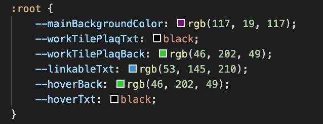
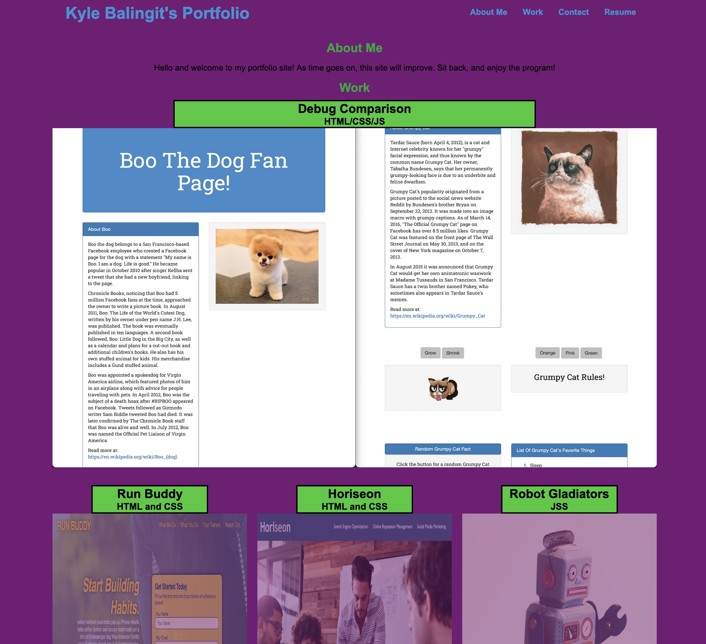
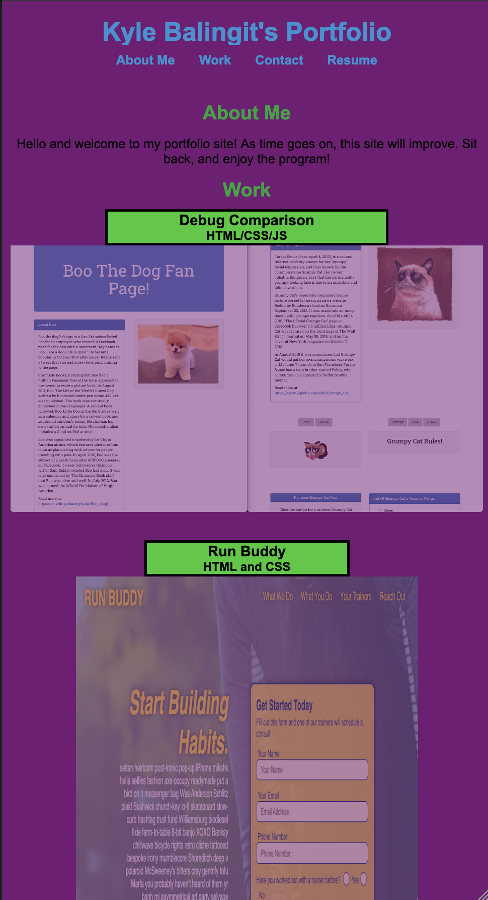

# Kyle Balingit's Portfolio [HTML/CSS]

The purpose of this webpage is to outline the various coding acomplishments of Kyle Balingit. However this site can be used as a template for anyone! Just pop in your own links and relevant information and you'll be good to go! This page was built for the purpose of keeping the elements centered (with a few elements collapsing from the right). The site is also mobile friendly and should look presentable on any phone screen / dektop screen. 

## Best Ways to Customize 

-In index.html, you'll find each section broken out by HTML <--comments-->

-The CSS sheet has various variables listed in :root that will change the various color elements without going into individual lines.

-Layouts will not be easily customizable and will require tinkering, but then why are you using my sheet if you have the know-how???

## Screenshot of Application

## TL:DR

HTML + CSS = ❤️️
